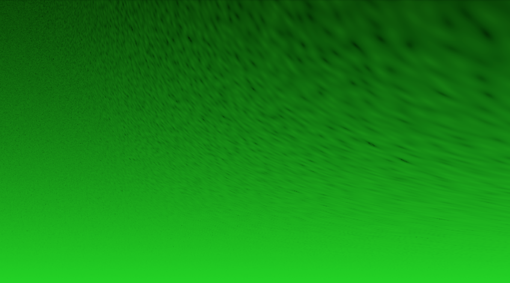
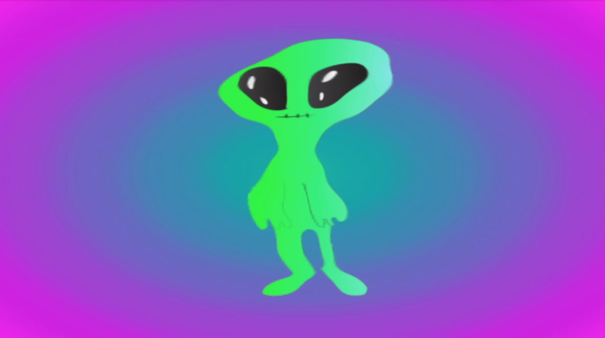
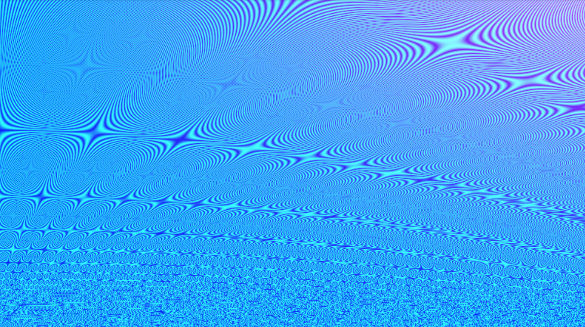
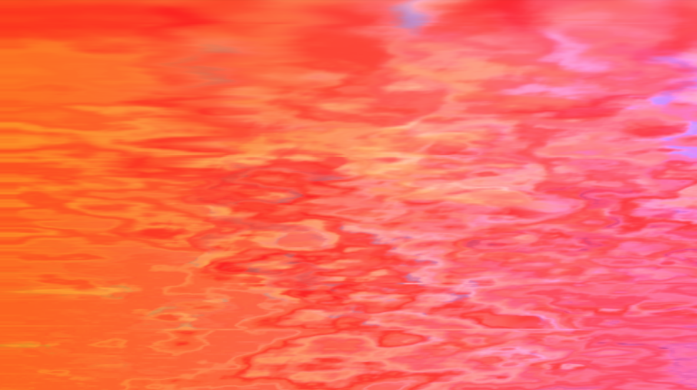

# SidiousShaders()

### A collection of experimental shaders in GLSL.

See the full collection on [CodePen](https://codepen.io/collection/XmBgzE).

- ### [What is GLSL?](https://en.wikipedia.org/wiki/OpenGL_Shading_Language)

- ### [How to use shaders with Three.js](https://threejs.org/docs/#api/en/materials/ShaderMaterial)

- ### [The Book of Shaders](https://thebookofshaders.com)

Special thanks to Nik Lever for his great [tutorial](https://www.udemy.com/course/learn-glsl-shaders-from-scratch/).

by [@sidiousvic](https://sidiousvic.dev)
